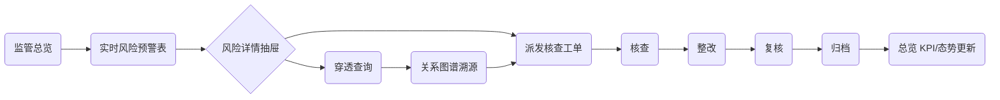
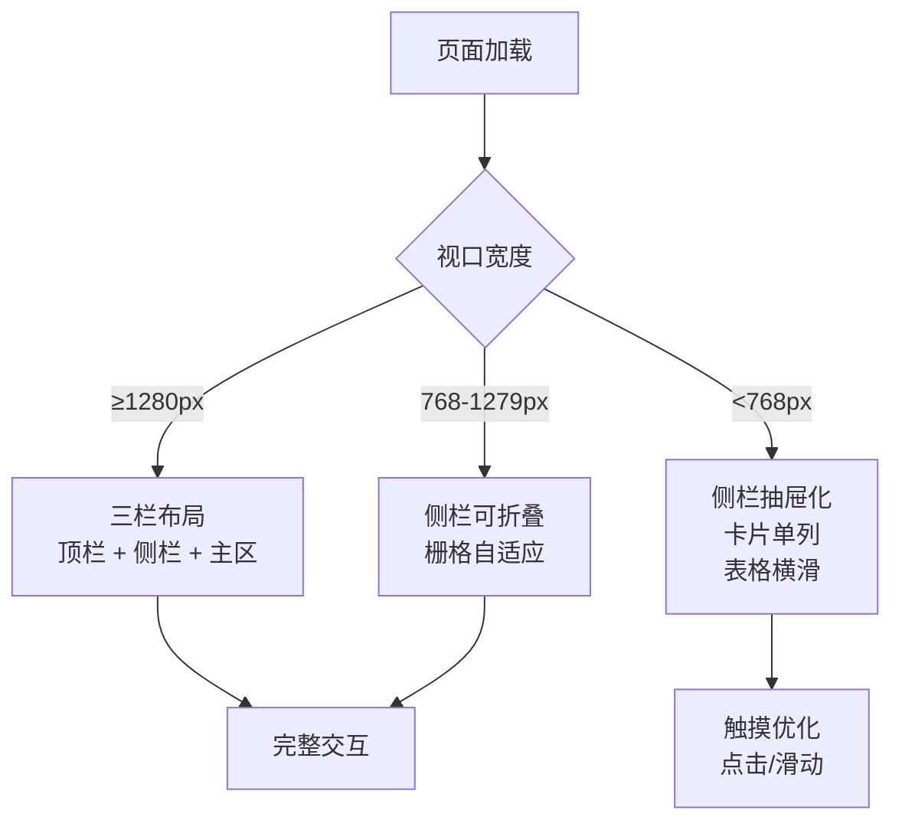

# 新兴际华穿透式监管平台 · 产品需求文档（PRD）

> 项目代号：XJH-PSP ｜ 版本：v1.0 ｜ 编制日期：2026-07-17

---

## 1. 产品概述

面向大型央企集团（新兴际华集团）的"穿透式监管平台"，以"一平台三中心"为顶层架构，覆盖**全级次组织、全链条业务、全过程时间、全要素对象**四大穿透维度，落地**十大监管领域、11+N 项重大风险**的实时识别、告警、核查、处置、归档全闭环。本前端工程是该平台的管理后台，对接 5 年落地实操方案中规划的浪潮 iGIX、司库系统等后端能力（本期以 Mock 数据呈现），供集团及二级、三级单位监管人员日常使用。

- **目标用户**：集团监管员、二级单位监管员、业务处室核查人员、调度指挥中心值班员、集团领导。
- **核心价值**：将原设计稿《监管总览》扩展为可运行的多页 Web 应用，并补充多端自适应与交互能力，作为后续接入真实后端 API 的前端基座。

---

## 2. 核心特性

### 2.1 用户角色

| 角色 | 注册方式 | 核心权限 |
|------|---------|---------|
| 集团监管员 | 系统分配 | 总览、穿透查询、风险预警、工单分派、关系图谱、指挥大屏、规则配置、审计日志 |
| 二级单位监管员 | 系统分配 | 本单位总览、穿透查询（受限）、本单位风险预警、本单位工单处置 |
| 业务核查人员 | 系统分配 | 待办工单处置、整改进度上报、复核归档 |
| 调度值班员 | 系统分配 | 指挥大屏、工单超时催办、应急处置流程触发 |
| 集团领导 | 系统分配 | 总览、指挥大屏、监管态势分析、监管报告查阅 |

### 2.2 功能模块

按设计稿侧栏分组结构组织页面，**总览页 1:1 还原设计稿**，其余为按方案规划补齐的主要二级页：

1. **监管总览**：战略框架 + KPI + 三大中心状态 + 十大领域 + 四个体系/五个强化 + 11+N 风险清单 + 四个保障 + 监管态势 3 张图表 + 实时风险预警表 + 工单处置表。
2. **数据采集中心**：数据采集概览、数据源管理、采集任务。
3. **智慧监督中心**：穿透查询、风险预警、关系图谱、规则配置。
4. **调度指挥中心**：核查工单、处置流程、指挥大屏。
5. **业务场景**：财务资金监管、投资决策监管、合规风控监管、安全生产监管。
6. **系统**：审计日志、系统设置。

### 2.3 页面清单（本期实现范围）

> 推荐选项：总览页 + 主要二级页。带 ★ 为本期必交付，☆ 为骨架占位。

| 页面 | 路由 | 优先级 |
|------|------|--------|
| 监管总览 | `/` | ★ |
| 数据采集概览 | `/collection/overview` | ★ |
| 数据源管理 | `/collection/sources` | ☆ |
| 采集任务 | `/collection/tasks` | ☆ |
| 穿透查询 | `/monitoring/penetration` | ★ |
| 风险预警 | `/monitoring/risk-warnings` | ★ |
| 关系图谱 | `/monitoring/graph` | ★ |
| 规则配置 | `/monitoring/rules` | ☆ |
| 核查工单 | `/dispatch/work-orders` | ★ |
| 处置流程 | `/dispatch/process` | ☆ |
| 指挥大屏 | `/dispatch/dashboard` | ★ |
| 财务资金监管 | `/scenarios/finance` | ★ |
| 投资决策监管 | `/scenarios/investment` | ☆ |
| 合规风控监管 | `/scenarios/compliance` | ☆ |
| 安全生产监管 | `/scenarios/safety` | ☆ |
| 审计日志 | `/system/audit` | ☆ |
| 系统设置 | `/system/settings` | ☆ |

### 2.4 页面详情

| 页面名 | 模块名 | 功能描述 |
|--------|--------|---------|
| 监管总览 | 顶部导航 + 左侧分组菜单 + 内容主区 | 1:1 还原设计稿；含一个目标横幅、四个要求带、5 KPI 卡、三大中心健康度、十大领域风险矩阵、四个体系+五个强化、11+N 风险胶囊、四个保障、3 张图表（折线/环形/柱状）、实时风险预警表、核查工单处置表 |
| 监管总览 | 时间筛选/刷新交互 | "今日/本周/本月"分段切换；刷新按钮带旋转动画并重置 mock 数据 |
| 监管总览 | 主题切换 | 暗色（默认）/ 亮色切换，状态持久化到 localStorage |
| 数据采集概览 | 采集 KPI | 采集源数、今日采集量、异常数、健康度进度条；按系统来源（浪潮/司库/其他）分类 |
| 数据采集概览 | 采集任务列表 | 任务名、来源系统、模式（全量/增量/CDC）、调度频率、最近状态、吞吐量、操作 |
| 数据采集概览 | 采集趋势图 | 近 30 天采集量与延迟双折线 |
| 穿透查询 | 关键字搜索 | 顶部搜索框联动：主体/资金/合同/项目四类穿透；返回结构化卡片 |
| 穿透查询 | 层级下钻树 | 集团 → 板块 → 二级 → 三级 → 凭证/流水，逐级展开 |
| 风险预警 | 筛选区 | 风险级别（高/中/低）、领域、状态（待处置/处理中/已处置）多选过滤 |
| 风险预警 | 列表 + 详情抽屉 | 列表与设计稿一致；点击行打开右侧抽屉，展示风险线索、关联工单、原始数据 |
| 关系图谱 | 图谱可视化 | 账户-交易对手-组织-人员四级关联；力导向布局，支持节点点击、高亮路径 |
| 核查工单 | 列表 + 进度步骤 | 工单编号、风险来源、负责人、当前节点（核查→整改→复核→归档）、进度条、状态、操作 |
| 核查工单 | 新建工单 | 弹窗：关联风险源、负责人、节点配置 |
| 指挥大屏 | 16:9 大屏 | 风险分布热力图、处置进度看板、资金流向态势、投资概览、待办统计；自动 30s 刷新指示器 |
| 财务资金监管 | 场景主页 | 资金异动监测、关联交易、虚假贸易、违规担保卡片；资金流向图谱缩略；趋势图 |
| 业务场景骨架页 | 投资决策/合规风控/安全生产/数据源/采集任务/规则/处置/审计/设置 | 沿用设计语言，标题 + 概览卡片 + 占位说明，保持与全站视觉一致 |

---

## 3. 核心流程

### 3.1 用户主流程（穿透监管闭环）

监管员打开总览 → 查看实时风险预警 → 点击进入风险详情抽屉 → 派发核查工单 → 工单流转（核查→整改→复核→归档）→ 处置结果回写 → 总览 KPI/态势图更新。

### 3.2 穿透查询流程

### 3.3 多端适配流程

---

## 4. 用户界面设计

### 4.1 设计风格

- **主色**：`#1664FF`（远立蓝 primary-6），暗色背景 `#0c0d0e` / 卡片 `#1d2129` / 分隔 `#333333`。
- **辅色**：成功 `#7ccd94`、告警 `#f0a50f`、危险 `#ff706d`、灰阶 `#86909c`。
- **图表色**：`#387bff` `#7ccd94` `#f0a50f` `#ff706d` `#86909c`。
- **字体**：`"PingFang SC", "Microsoft YaHei", "Helvetica Neue", Arial, sans-serif`；数字优先等宽 `SF Mono / Menlo / Consolas`。
- **字号体系**：display 24 / h1 20 / h2 18 / h3 16 / h4 14 / lead 13 / body 12 / caption 10。
- **圆角**：sm 4 / md 8 / lg 12 / xl 16 / pill 9999。
- **阴影**：5 级 elevation，暗色场景下使用更深的 `rgba(0,0,0,0.32~0.5)` 阴影。
- **布局**：顶部导航 48px + 左侧侧栏 200px + 主内容区，最大内容宽度 1440px，桌面 gutter 24px、移动 16px。
- **图标**：Lucide React 线性图标，1.5px stroke，与设计稿 SVG 风格一致。
- **氛围**：暗色 + 蓝色辉光渐变（mission-banner），轻微噪点纹理增强深度，状态徽章彩色描边。

### 4.2 页面设计概览

| 页面名 | 模块名 | UI 元素 |
|--------|--------|---------|
| 全局 | 顶部导航 | 48px 高，汉堡 + Logo + 平台名 + 搜索 + 预警铃铛（含数字徽章）+ 帮助 + 用户头像下拉 |
| 全局 | 左侧侧栏 | 200px 宽，按"主菜单/数据采集中心/智慧监督中心/调度指挥中心/业务场景/系统"分组，活跃项左侧蓝色 3px 指示条，可折叠 |
| 监管总览 | 一个目标 | 渐变蓝 banner，圆形目标图标，战略框架徽章 |
| 监管总览 | 四个要求 | 4 列横向条，每列含彩色图标方块 + 名称 + 副标题，列间细分隔线 |
| 监管总览 | KPI | 5 列网格，每张卡含图标徽章 + 标签 + 大号数字 + 趋势 status-tag |
| 监管总览 | 三大中心 | 3 列网格，每张卡含名称 + 状态标签 + 3 个 metric + 健康度进度条 |
| 监管总览 | 十大领域 | 5×2 网格，紧凑卡：领域名 + 风险级别 tag + 大号风险数 + 描述 |
| 监管总览 | 四个体系 + 五个强化 | 2 列布局，每列内部 2×2 / 2×3 卡片网格，含编号/图标方块 |
| 监管总览 | 11+N 风险清单 | 胶囊标签流式布局，按高/中/低/扩展四色区分 |
| 监管总览 | 四个保障 | 4 列网格，图标 + 名称 + 描述 |
| 监管总览 | 监管态势 | 3 列图表卡：折线 + 环形（含中心数字）+ 横向柱状（含数值标签） |
| 监管总览 | 实时风险预警表 | 8 列表格，行 hover 高亮，状态 tag 着色 |
| 监管总览 | 核查工单处置表 | 7 列表格，含迷你步骤条 + 进度条 |
| 穿透查询 | 搜索 + 树 | 顶部 4 类 tab + 关键字输入，下方树形下钻 + 详情面板 |
| 风险预警 | 列表 + 抽屉 | 筛选条 + 表格 + 右侧 480px 抽屉 |
| 关系图谱 | 图谱 | 力导向 SVG/Canvas，节点 hover 高亮邻接边 |
| 指挥大屏 | 16:9 | 黑底 + 蓝色辉光，5 个模块卡片网格，定时刷新指示器 |
| 财务资金监管 | 场景主页 | 4 卡片风险概览 + 资金流向图谱缩略 + 30 天趋势 |

### 4.3 响应式

- **桌面优先**：≥1280px 完整三栏；1440px 居中。
- **平板（768-1279px）**：侧栏可折叠为 64px 图标模式；KPI/领域/中心网格由 5/3 列降为 3/2 列；图表区由 3 列降为 2 列；表格保持横滑。
- **手机（<768px）**：顶栏搜索折叠为图标按钮；侧栏改为抽屉式（汉堡触发，遮罩层）；所有网格降为单列；表格横向滚动 + 首列粘性；图表高度压缩到 180px；指挥大屏提示"建议横屏/PC 查看体验更佳"。
- **触摸优化**：按钮最小高度 36px；hover 状态在 touch 设备退化为 active；图表 tooltip 改为点击触发。
- **断点**：`sm 640 / md 768 / lg 1024 / xl 1280 / 2xl 1536`（Tailwind 默认）。

### 4.4 动效

- 页面切换：`view-transition-name` + 200ms 渐隐。
- KPI 数字：首次加载 count-up 动画（600ms）。
- 表格行：进入时 `staggered fade-in`，每行 30ms 延迟。
- 刷新按钮：点击 360° 旋转一周（500ms）。
- 风险预警新条目：左边缘红色脉冲 2 次。
- 抽屉：右侧滑入 240ms `cubic-bezier(0.32, 0.72, 0, 1)`。
- 大屏刷新指示器：呼吸点动画。

---

## 5. 非功能需求

- **性能**：首屏 LCP ≤ 2s（参考方案阶段 5 指标）；图表按需渲染，离开视口暂停动画。
- **可访问性**：WCAG AA，键盘可达，焦点环可见，对比度 ≥ 4.5:1。
- **浏览器**：Chrome 100+ / Edge 100+ / Safari 15+ / Firefox 100+；信创麒麟自带浏览器 UOS 1.0+。
- **国际化**：本期仅中文，文案集中管理便于后续抽离。
- **状态持久化**：主题、侧栏折叠、最近筛选条件存 localStorage。

---

## 6. 数据策略

- 本期纯前端 Mock：在 `src/mock/` 下集中维护总览、工单、风险、采集、关系图谱等数据集。
- 预留 `src/api/` 接口封装层，类型与后端 OpenAPI 对齐，便于后续对接浪潮 iGIX / 司库 / Doris / NebulaGraph 等真实接口。
- 时间基准统一为 `2026-07-16`，与设计稿保持一致。

---

## 7. 验收标准

1. 设计稿《监管总览》1:1 视觉还原，所有 12 个内容区块齐全，颜色/字体/间距 token 体系一致。
2. 7 个主要二级页（采集概览、穿透查询、风险预警、关系图谱、核查工单、指挥大屏、财务资金监管）功能可用、交互完整。
3. 9 个骨架页（数据源/采集任务/规则/处置/投资/合规/安全/审计/设置）沿用设计语言，无空白。
4. 桌面 / 平板 / 手机三档断点下布局正确，无横向溢出。
5. 暗色/亮色主题切换正常，状态持久化。
6. 侧栏菜单全部可点击路由跳转，活跃项高亮。
7. `pnpm dev` 一键启动，`pnpm build` 产物可通过 `pnpm preview` 预览。
