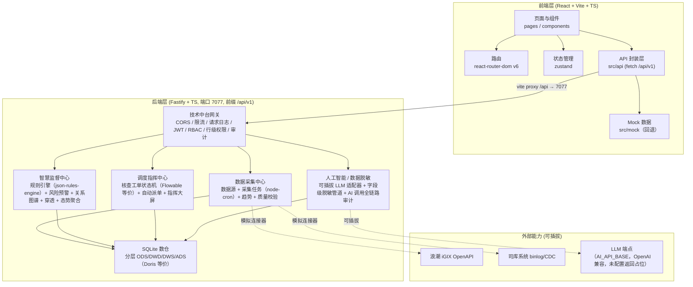
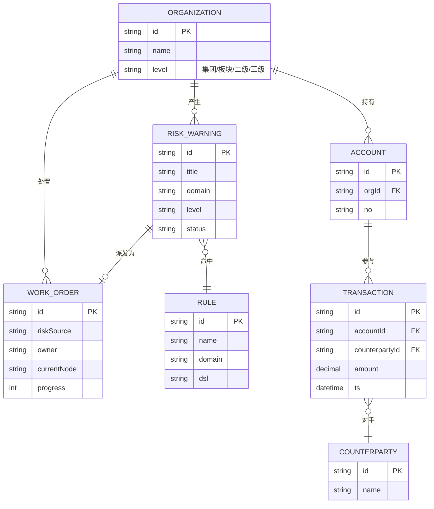

# 新兴际华穿透式监管平台 · 技术架构文档

> 配套 PRD v1.0 ｜ 版本：v1.0 ｜ 编制日期：2026-07-17

---

## 1. 架构设计

前端工程已对接真实后端，默认走后端 API（`VITE_USE_MOCK` 未设即走后端，`VITE_USE_MOCK=true` 回退 Mock）。



> **后端层落地说明**：5 年方案中的分布式组件（Apache Doris / NebulaGraph / Drools / Flowable / RocketMQ / DolphinScheduler / Apache Ranger 脱敏 / LangChain / APISIX / Keycloak / HertzBeat 等）在后端工程中以**同语义的轻量开源实现**承载，保证业务模型、API 契约、数据流转与方案一致，可平滑替换为生产级分布式组件。具体映射见 spec `技术映射` 表。SQLite 数仓承载分层视图（ODS/DWD/DWS/ADS），关系图谱用进程内邻接表 + SQLite 实现 BFS 跳数查询，规则引擎基于 `json-rules-engine`，工单状态机为 `verify → rectify → review → archive` 进程内实现，事件总线用 Node `events` 模拟 RocketMQ 异步解耦。AI 链路零原始敏感数据外送：所有业务数据传入 LLM 前必经 `sanitizeForAI(payload, policy)` 字段级脱敏管道（掩码 / 哈希 / 替换 / 区间化），脱敏事件写审计表，AI 调用全链路（入参脱敏后摘要 / 出参 / 耗时 / token）落 `ai_call_logs`。

---

## 2. 技术说明

| 层 | 技术选型 | 说明 |
|----|---------|------|
| 前端框架 | React 18 + TypeScript 5 | 函数组件 + Hooks |
| 构建工具 | Vite 5 | 极速 HMR，ESBuild 预构建 |
| 路由 | react-router-dom 6 | 数据路由 + 嵌套布局 |
| 状态管理 | zustand 4 | 轻量全局状态：主题、侧栏、用户、筛选 |
| 样式方案 | Tailwind CSS 3 + CSS 变量 | 沿用设计稿 token 体系（远立蓝/暗色），`tailwind.config.js` 扩展颜色映射 |
| 图表库 | Recharts 2 | 折线 / 环形 / 横向柱状，与设计稿 Chart.js 视觉一致 |
| 图谱可视化 | react-force-graph-2d（轻量）或自研 SVG 力导向 | 关系图谱页 |
| 图标 | lucide-react | 线性图标，1.5px stroke |
| 工具库 | clsx + tailwind-merge | 类名组合 |
| 包管理 | pnpm（首选）或 npm | 锁文件 `pnpm-lock.yaml` |
| 初始化模板 | vite-init react-ts | 已含 react-router-dom / tailwind / zustand |
| 后端 | 无（本期） | API 层预留接口签名 |
| 数据库 | 无（本期） | Mock 数据集 |

---

## 3. 路由定义

```ts
// 懒加载仅在 dev 体验上无差异，按规范不使用动态 import，全部静态导入
const routes = [
  { path: '/',                      element: <OverviewPage /> },
  { path: '/collection/overview',   element: <CollectionOverviewPage /> },
  { path: '/collection/sources',    element: <SourcesPage /> },
  { path: '/collection/tasks',      element: <TasksPage /> },
  { path: '/monitoring/penetration',element: <PenetrationPage /> },
  { path: '/monitoring/risk-warnings', element: <RiskWarningsPage /> },
  { path: '/monitoring/graph',      element: <GraphPage /> },
  { path: '/monitoring/rules',      element: <RulesPage /> },
  { path: '/dispatch/work-orders',  element: <WorkOrdersPage /> },
  { path: '/dispatch/process',      element: <ProcessPage /> },
  { path: '/dispatch/dashboard',    element: <BigScreenPage /> },
  { path: '/scenarios/finance',     element: <FinancePage /> },
  { path: '/scenarios/investment',  element: <InvestmentPage /> },
  { path: '/scenarios/compliance',  element: <CompliancePage /> },
  { path: '/scenarios/safety',      element: <SafetyPage /> },
  { path: '/system/audit',          element: <AuditPage /> },
  { path: '/system/settings',       element: <SettingsPage /> },
];
```

| 路由 | 用途 |
|------|------|
| `/` | 监管总览，1:1 还原设计稿 |
| `/collection/overview` | 数据采集中心-概览 |
| `/collection/sources` | 数据源管理（骨架） |
| `/collection/tasks` | 采集任务（骨架） |
| `/monitoring/penetration` | 穿透查询 |
| `/monitoring/risk-warnings` | 风险预警 |
| `/monitoring/graph` | 关系图谱 |
| `/monitoring/rules` | 规则配置（骨架） |
| `/dispatch/work-orders` | 核查工单 |
| `/dispatch/process` | 处置流程（骨架） |
| `/dispatch/dashboard` | 指挥大屏 |
| `/scenarios/finance` | 财务资金监管 |
| `/scenarios/investment` | 投资决策监管（骨架） |
| `/scenarios/compliance` | 合规风控监管（骨架） |
| `/scenarios/safety` | 安全生产监管（骨架） |
| `/system/audit` | 审计日志（骨架） |
| `/system/settings` | 系统设置（骨架） |

---

## 4. API 定义（已实现）

> **状态更新**：后端 `/workspace/server` 已落地实现（Fastify + TS，端口 7077，统一前缀 `/api/v1`），前端 `src/api/index.ts` 通过 `fetch` 调用真实接口，保留 `VITE_USE_MOCK=true` 回退 Mock。类型契约 `src/api/types.ts` 不变，后端按此契约返回。Vite 已将 `/api` 代理至 `http://localhost:7077`，前后端联调打通。

类型集中放在 `src/api/types.ts`，对接真实后端时仅需替换实现：

```ts
// src/api/types.ts
export interface KpiSnapshot {
  coverageRate: number;       // 监管覆盖率 %
  penetrationLevel: number;   // 穿透层级
  riskCount: number;           // 风险预警数
  pendingOrders: number;       // 待处置工单
  dataVolume: number;          // 数据采集量（条）
}

export interface RiskWarning {
  id: string;
  title: string;
  domain: string;
  level: 'high' | 'medium' | 'low';
  subject: string;
  rule: string;
  triggeredAt: string;        // ISO
  status: 'pending' | 'processing' | 'resolved';
}

export interface WorkOrder {
  id: string;
  riskSource: string;
  owner: string;
  currentNode: 'verify' | 'rectify' | 'review' | 'archive';
  progress: number;            // 0-100
  status: 'processing' | 'archived';
}

export interface GraphNode {
  id: string;
  label: string;
  type: 'account' | 'counterparty' | 'org' | 'person';
}
export interface GraphEdge { source: string; target: string; label?: string; }
```

API 调用层封装在 `src/api/index.ts`，默认走真实后端：

```ts
// src/api/index.ts
const USE_MOCK = (import.meta.env.VITE_USE_MOCK as string | undefined) === "true";
const API_BASE = (import.meta.env.VITE_API_BASE as string | undefined) || "/api/v1";

// 默认：fetch(`${API_BASE}/monitoring/overview`, ...)
// VITE_USE_MOCK=true：回退 mock.xxx
```

### 已实现关键端点（统一前缀 `/api/v1`，需 JWT 除非注明）

| 模块 | 端点 | 说明 |
|------|------|------|
| **auth** | `POST /auth/login`<br/>`POST /auth/logout` | 用户名密码登录返回 JWT；登出落审计。5 类角色：admin / group_admin / inspector / duty_officer / leader |
| **monitoring** | `GET /monitoring/overview`<br/>`GET /monitoring/risk-warnings`<br/>`GET /monitoring/risk-warnings/:id`<br/>`PUT /monitoring/risk-warnings/:id/status`<br/>`GET /monitoring/graph`<br/>`GET /monitoring/graph/all`<br/>`GET /monitoring/penetration/tree`<br/>`GET /monitoring/trend`<br/>`GET /monitoring/doughnut`<br/>`GET /monitoring/health-bars`<br/>`GET /monitoring/finance/risks`<br/>`GET /monitoring/finance/trend`<br/>`GET /monitoring/rules`<br/>`POST /monitoring/rules`<br/>`PUT /monitoring/rules/:id`<br/>`DELETE /monitoring/rules/:id`<br/>`POST /monitoring/rules/:id/evaluate` | 监管总览聚合、风险预警筛选/详情/状态变更、关系图谱 BFS、穿透树、采集/财务趋势、风险分布环形图、健康度柱状图、财务资金风险卡片、规则 CRUD + 规则推理命中（生成 risk_warning + EventBus 推送告警） |
| **collection** | `GET /collection/overview`<br/>`GET /collection/tasks`<br/>`GET /collection/tasks/:id`<br/>`POST /collection/tasks`<br/>`GET /collection/sources`<br/>`GET /collection/sources/:id`<br/>`POST /collection/sources`<br/>`GET /collection/trend` | 数据源 CRUD、采集任务编排（全量/增量/CDC 三模式）、采集趋势、数据质量校验 |
| **dispatch** | `GET /dispatch/work-orders`<br/>`GET /dispatch/work-orders/:id`<br/>`POST /dispatch/work-orders`<br/>`POST /dispatch/work-orders/:id/advance`<br/>`PUT /dispatch/work-orders/:id`<br/>`GET /dispatch/dashboard` | 核查工单 CRUD + 节点流转（verify→rectify→review→archive）、归档时回写关联风险为 resolved、指挥大屏聚合（KPI/热力图/待办统计） |
| **system** | `GET /system/audit`<br/>`GET /system/settings`<br/>`PUT /system/settings` | 审计日志分页查询（按用户/操作/时间）、系统配置读取与更新（需 admin） |
| **ai** | `GET /ai/health`<br/>`POST /ai/query`<br/>`POST /ai/contract-review`<br/>`POST /ai/risk-report`<br/>`GET /ai/sanitizer/policies`<br/>`POST /ai/sanitizer/policies`<br/>`PUT /ai/sanitizer/policies/:id`<br/>`DELETE /ai/sanitizer/policies/:id`<br/>`GET /ai/logs` | AI 适配器健康检查、自然语言穿透查询、合同审查、风险报告生成（前置脱敏）、脱敏策略 CRUD、AI 调用全链路日志查询 |
| **平台** | `GET /health`<br/>`GET /metrics` | 健康检查（无需鉴权）、Prometheus 指标暴露（`http_requests_total` / `risk_evaluations_total` / `workorder_advance_total` / `collection_runs_total` / `ai_calls_total`） |

---

## 5. 数据模型

### 5.1 数据模型定义

本期 mock 数据按业务实体组织：



### 5.2 数据定义语言（DDL，预留）

后端落库时参考，本期不实际执行：

```sql
-- 风险预警表
CREATE TABLE risk_warning (
  id            VARCHAR(32) PRIMARY KEY,
  title         VARCHAR(200) NOT NULL,
  domain        VARCHAR(64) NOT NULL,
  level         VARCHAR(8) NOT NULL,   -- high/medium/low
  subject       VARCHAR(128),
  rule_id       VARCHAR(32),
  triggered_at  DATETIME NOT NULL,
  status        VARCHAR(16) NOT NULL   -- pending/processing/resolved
);

-- 核查工单表
CREATE TABLE work_order (
  id            VARCHAR(32) PRIMARY KEY,
  risk_source   VARCHAR(128),
  owner         VARCHAR(64),
  current_node  VARCHAR(16),           -- verify/rectify/review/archive
  progress      INT,
  status        VARCHAR(16),
  created_at    DATETIME
);

-- 索引
CREATE INDEX idx_risk_status ON risk_warning(status, level);
CREATE INDEX idx_wo_owner    ON work_order(owner, status);
```

---

## 6. 目录结构

```
penetration-supervision-platform/
├── index.html
├── package.json
├── pnpm-lock.yaml
├── tsconfig.json
├── vite.config.ts
├── tailwind.config.js
├── postcss.config.js
├── .trae/documents/
│   ├── PRD.md
│   └── 技术架构.md
├── public/
└── src/
    ├── main.tsx
    ├── App.tsx                       # Router + Layout
    ├── index.css                     # 全局 token + Tailwind 指令
    ├── api/
    │   ├── index.ts                  # 调用层（本期 mock）
    │   └── types.ts
    ├── mock/
    │   ├── overview.ts               # KPI / 三大中心 / 十大领域 / 框架 / 风险清单 / 工单
    │   ├── riskWarnings.ts
    │   ├── workOrders.ts
    │   ├── collection.ts
    │   ├── graph.ts
    │   └── finance.ts
    ├── store/
    │   ├── themeStore.ts             # 主题切换
    │   ├── layoutStore.ts            # 侧栏折叠 / 移动抽屉
    │   └── filterStore.ts            # 时间段、风险筛选
    ├── components/
    │   ├── layout/
    │   │   ├── AppLayout.tsx         # 三栏外壳
    │   │   ├── TopNav.tsx
    │   │   ├── SideNav.tsx
    │   │   └── PageContainer.tsx
    │   ├── ui/
    │   │   ├── Card.tsx
    │   │   ├── StatusTag.tsx
    │   │   ├── Progress.tsx
    │   │   ├── Segmented.tsx
    │   │   ├── Stat.tsx
    │   │   ├── MiniSteps.tsx
    │   │   ├── DataTable.tsx
    │   │   └── Drawer.tsx
    │   ├── charts/
    │   │   ├── RiskTrendChart.tsx
    │   │   ├── RiskDoughnutChart.tsx
    │   │   └── HealthBarChart.tsx
    │   └── overview/                  # 监管总览专属区块
    │       ├── MissionBanner.tsx
    │       ├── PenetrationBar.tsx
    │       ├── KpiGrid.tsx
    │       ├── CenterGrid.tsx
    │       ├── DomainGrid.tsx
    │       ├── FrameworkRow.tsx
    │       ├── RiskCatalog.tsx
    │       ├── GuaranteeSection.tsx
    │       ├── RiskWarningTable.tsx
    │       └── WorkOrderTable.tsx
    ├── pages/
    │   ├── OverviewPage.tsx
    │   ├── CollectionOverviewPage.tsx
    │   ├── SourcesPage.tsx
    │   ├── TasksPage.tsx
    │   ├── PenetrationPage.tsx
    │   ├── RiskWarningsPage.tsx
    │   ├── GraphPage.tsx
    │   ├── RulesPage.tsx
    │   ├── WorkOrdersPage.tsx
    │   ├── ProcessPage.tsx
    │   ├── BigScreenPage.tsx
    │   ├── FinancePage.tsx
    │   ├── InvestmentPage.tsx
    │   ├── CompliancePage.tsx
    │   ├── SafetyPage.tsx
    │   ├── AuditPage.tsx
    │   ├── SettingsPage.tsx
    │   └── SkeletonPage.tsx          # 通用骨架页（接受标题/描述/图标）
    ├── hooks/
    │   ├── useCountUp.ts
    │   └── useMediaQuery.ts
    └── utils/
        ├── cn.ts
        └── format.ts
```

---

## 7. 设计 Token 映射

将设计稿 CSS 变量映射到 Tailwind 主题，保证视觉一致：

```js
// tailwind.config.js (节选)
theme: {
  extend: {
    colors: {
      primary: { DEFAULT: '#1664ff', hover: '#0055ff' },
      chart: {
        1: '#387bff', 2: '#7ccd94', 3: '#f0a50f', 4: '#ff706d', 5: '#86909c',
      },
      surface: {
        DEFAULT: '#1d2129',        // 卡片
        dim: '#000b1a',            // 最暗
        container: '#202833',
        high: '#2a3440',
        highest: '#41464f',
      },
      success: '#7ccd94',
      warning: '#f0a50f',
      danger:  '#ff706d',
      muted:   '#86909c',
    },
    fontFamily: {
      sans: ['"PingFang SC"', '"Microsoft YaHei"', '"Helvetica Neue"', 'Arial', 'sans-serif'],
      mono: ['"SF Mono"', 'Menlo', 'Consolas', 'monospace'],
    },
    borderRadius: { sm: '4px', md: '8px', lg: '12px', xl: '16px' },
    fontSize: {
      caption: ['10px', '18px'],
      body:    ['12px', '20px'],
      lead:    ['13px', '22px'],
      h4:      ['14px', '22px'],
      h3:      ['16px', '24px'],
      h2:      ['18px', '26px'],
      h1:      ['20px', '28px'],
      display: ['24px', '32px'],
    },
  },
}
```

亮色主题通过 `html.light` 类切换变量集（与设计稿 `:root` 一致）。

---

## 8. 主题切换策略

- 默认 `dark`（与设计稿一致）。
- `html` 元素挂 `class="dark"` 或 `class="light"`。
- zustand `themeStore` 读取 `localStorage.theme`，缺省 `dark`。
- 切换按钮放在顶部导航右侧用户区前。

---

## 9. 多端适配实现要点

- **侧栏**：`md` 以下变为抽屉，由 `layoutStore.drawerOpen` 控制；遮罩层点击关闭。
- **顶栏搜索**：`md` 以下隐藏输入框，仅保留放大镜图标按钮，点击展开浮层输入。
- **KPI 网格**：`grid-cols-1 sm:grid-cols-2 lg:grid-cols-5`。
- **领域网格**：`grid-cols-2 sm:grid-cols-3 lg:grid-cols-5`。
- **三大中心**：`grid-cols-1 lg:grid-cols-3`。
- **图表区**：`grid-cols-1 lg:grid-cols-3`，移动端单列高度 180px。
- **表格**：包裹 `.table-wrapper` 容器，`overflow-x-auto`，首列 `sticky left-0`。

---

## 10. 构建与运行

```bash
# 安装
pnpm install

# 开发
pnpm dev          # 默认 http://localhost:5173

# 类型检查
pnpm check        # tsc --noEmit

# 生产构建
pnpm build

# 预览构建产物
pnpm preview
```

---

## 11. 与 5 年落地实操方案的对齐

> **状态更新**：后端 `/workspace/server` 已落地，5 年方案阶段 1-3 能力 + AI 脱敏链路已实现并通过 Smoke 自测（`/workspace/server/scripts/smoke.sh`，22/22 通过）与端到端闭环验证（`scripts/closed-loop.sh`，规则评估→自动派单→工单流转→归档→风险回写 resolved 全链路打通）。

| 方案阶段 | 本期对应能力（已实现） |
|---------|-------------|
| 阶段 1 基础底座 | 数据采集中心：数据源 CRUD、采集任务编排（全量/增量/CDC 三模式，node-cron 调度）、采集趋势、数据质量校验；SQLite 数仓分层 ODS/DWD/DWS/ADS；`/health` + `/metrics` 监控 |
| 阶段 2 智慧监督 | 规则引擎（json-rules-engine，规则 CRUD + 推理命中 → 生成 risk_warning + EventBus 推送告警）、关系图谱 BFS（账户-对手-组织-人员四级，进程内邻接表）、穿透查询树（集团→板块→三级→账户/凭证）、风险预警筛选/详情/状态变更、监管态势聚合（KPI/三中心/十领域/框架/风险目录/保障/趋势/环形图/柱状图/财务资金风险卡片） |
| 阶段 3 调度指挥 | 核查工单状态机（verify→rectify→review→archive，Flowable 等价）、high 级别预警自动派单（EventBus 消费者按领域分派责任人）、工单流转 / 归档回写风险为 resolved、指挥大屏聚合（KPI/热力图/待办统计）、超时工单检查 |
| 阶段 4 AI 全域 | AI 网关端口已落地：自然语言穿透查询 / 合同违规审查 / 风险处置报告自动生成；可插拔 LLM 适配器（OpenAI 兼容，未配置 `AI_API_BASE` 返回结构化占位响应）；**数据脱敏链路已实现**——所有业务数据传入 LLM 前必经 `sanitizeForAI(payload, policy)` 字段级脱敏管道（mask/hash/replace/range 四算法），脱敏事件落审计表，AI 调用全链路（入参脱敏后摘要 / 出参摘要 / 耗时 / token / 调用者）写 `ai_call_logs` 可追溯 |
| 阶段 5 资产运营 | 监管总览态势分析图表、审计日志（查询/处置/登录/脱敏/AI 调用全留痕）、5 类角色 RBAC + 行级数据权限（按组织层级过滤） |

**统一技术中台已落地**：JWT 鉴权（Keycloak 等价）、统一网关（APISIX 等价：CORS / 限流 / 请求 ID / 请求日志）、行级权限 + 审计（Ranger 等价）、Prometheus 指标（HertzBeat 等价）、事件总线（RocketMQ 等价，进程内 `events`）。分布式组件以同语义轻量实现承载，可平滑替换为生产级组件。

前后端联调已打通：`vite.config.ts` 代理 `/api → http://localhost:7077`，前端默认走真实后端；`VITE_USE_MOCK=true` 可回退 Mock 独立运行（已验证）。
