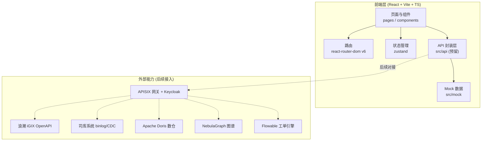
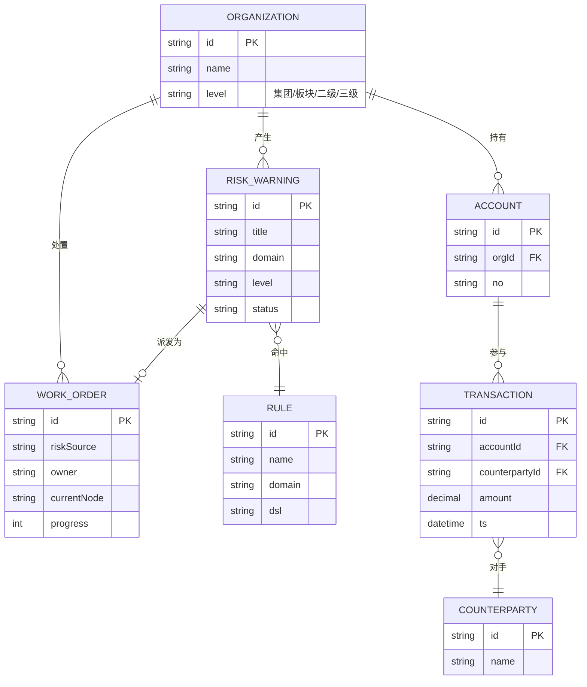

# 新兴际华穿透式监管平台 · 技术架构文档

> 配套 PRD v1.0 ｜ 版本：v1.0 ｜ 编制日期：2026-07-17

---

## 1. 架构设计

本期为纯前端工程（Mock 数据），后续可平滑接入后端 API。



---

## 2. 技术说明

| 层 | 技术选型 | 说明 |
|----|---------|------|
| 前端框架 | React 18 + TypeScript 5 | 函数组件 + Hooks |
| 构建工具 | Vite 5 | 极速 HMR，ESBuild 预构建 |
| 路由 | react-router-dom 6 | 数据路由 + 嵌套布局 |
| 状态管理 | zustand 4 | 轻量全局状态：主题、侧栏、用户、筛选 |
| 样式方案 | Tailwind CSS 3 + CSS 变量 | 沿用设计稿 token 体系（远立蓝/暗色），`tailwind.config.js` 扩展颜色映射 |
| 图表库 | Recharts 2 | 折线 / 环形 / 横向柱状，与设计稿 Chart.js 视觉一致 |
| 图谱可视化 | react-force-graph-2d（轻量）或自研 SVG 力导向 | 关系图谱页 |
| 图标 | lucide-react | 线性图标，1.5px stroke |
| 工具库 | clsx + tailwind-merge | 类名组合 |
| 包管理 | pnpm（首选）或 npm | 锁文件 `pnpm-lock.yaml` |
| 初始化模板 | vite-init react-ts | 已含 react-router-dom / tailwind / zustand |
| 后端 | 无（本期） | API 层预留接口签名 |
| 数据库 | 无（本期） | Mock 数据集 |

---

## 3. 路由定义

```ts
// 懒加载仅在 dev 体验上无差异，按规范不使用动态 import，全部静态导入
const routes = [
  { path: '/',                      element: <OverviewPage /> },
  { path: '/collection/overview',   element: <CollectionOverviewPage /> },
  { path: '/collection/sources',    element: <SourcesPage /> },
  { path: '/collection/tasks',      element: <TasksPage /> },
  { path: '/monitoring/penetration',element: <PenetrationPage /> },
  { path: '/monitoring/risk-warnings', element: <RiskWarningsPage /> },
  { path: '/monitoring/graph',      element: <GraphPage /> },
  { path: '/monitoring/rules',      element: <RulesPage /> },
  { path: '/dispatch/work-orders',  element: <WorkOrdersPage /> },
  { path: '/dispatch/process',      element: <ProcessPage /> },
  { path: '/dispatch/dashboard',    element: <BigScreenPage /> },
  { path: '/scenarios/finance',     element: <FinancePage /> },
  { path: '/scenarios/investment',  element: <InvestmentPage /> },
  { path: '/scenarios/compliance',  element: <CompliancePage /> },
  { path: '/scenarios/safety',      element: <SafetyPage /> },
  { path: '/system/audit',          element: <AuditPage /> },
  { path: '/system/settings',       element: <SettingsPage /> },
];
```

| 路由 | 用途 |
|------|------|
| `/` | 监管总览，1:1 还原设计稿 |
| `/collection/overview` | 数据采集中心-概览 |
| `/collection/sources` | 数据源管理（骨架） |
| `/collection/tasks` | 采集任务（骨架） |
| `/monitoring/penetration` | 穿透查询 |
| `/monitoring/risk-warnings` | 风险预警 |
| `/monitoring/graph` | 关系图谱 |
| `/monitoring/rules` | 规则配置（骨架） |
| `/dispatch/work-orders` | 核查工单 |
| `/dispatch/process` | 处置流程（骨架） |
| `/dispatch/dashboard` | 指挥大屏 |
| `/scenarios/finance` | 财务资金监管 |
| `/scenarios/investment` | 投资决策监管（骨架） |
| `/scenarios/compliance` | 合规风控监管（骨架） |
| `/scenarios/safety` | 安全生产监管（骨架） |
| `/system/audit` | 审计日志（骨架） |
| `/system/settings` | 系统设置（骨架） |

---

## 4. API 定义（预留）

类型集中放在 `src/api/types.ts`，对接真实后端时仅需替换实现：

```ts
// src/api/types.ts
export interface KpiSnapshot {
  coverageRate: number;       // 监管覆盖率 %
  penetrationLevel: number;   // 穿透层级
  riskCount: number;           // 风险预警数
  pendingOrders: number;       // 待处置工单
  dataVolume: number;          // 数据采集量（条）
}

export interface RiskWarning {
  id: string;
  title: string;
  domain: string;
  level: 'high' | 'medium' | 'low';
  subject: string;
  rule: string;
  triggeredAt: string;        // ISO
  status: 'pending' | 'processing' | 'resolved';
}

export interface WorkOrder {
  id: string;
  riskSource: string;
  owner: string;
  currentNode: 'verify' | 'rectify' | 'review' | 'archive';
  progress: number;            // 0-100
  status: 'processing' | 'archived';
}

export interface GraphNode {
  id: string;
  label: string;
  type: 'account' | 'counterparty' | 'org' | 'person';
}
export interface GraphEdge { source: string; target: string; label?: string; }
```

API 调用层封装在 `src/api/index.ts`，本期返回 mock：

```ts
// src/api/index.ts
import * as mock from '@/mock';
import type { KpiSnapshot, RiskWarning, WorkOrder } from './types';

export async function getKpiSnapshot(): Promise<KpiSnapshot> {
  return mock.kpiSnapshot;
}
export async function listRiskWarnings(filter?): Promise<RiskWarning[]> { ... }
export async function listWorkOrders(): Promise<WorkOrder[]> { ... }
// 后续替换为 fetch('/api/...', ...) 即可
```

---

## 5. 数据模型

### 5.1 数据模型定义

本期 mock 数据按业务实体组织：



### 5.2 数据定义语言（DDL，预留）

后端落库时参考，本期不实际执行：

```sql
-- 风险预警表
CREATE TABLE risk_warning (
  id            VARCHAR(32) PRIMARY KEY,
  title         VARCHAR(200) NOT NULL,
  domain        VARCHAR(64) NOT NULL,
  level         VARCHAR(8) NOT NULL,   -- high/medium/low
  subject       VARCHAR(128),
  rule_id       VARCHAR(32),
  triggered_at  DATETIME NOT NULL,
  status        VARCHAR(16) NOT NULL   -- pending/processing/resolved
);

-- 核查工单表
CREATE TABLE work_order (
  id            VARCHAR(32) PRIMARY KEY,
  risk_source   VARCHAR(128),
  owner         VARCHAR(64),
  current_node  VARCHAR(16),           -- verify/rectify/review/archive
  progress      INT,
  status        VARCHAR(16),
  created_at    DATETIME
);

-- 索引
CREATE INDEX idx_risk_status ON risk_warning(status, level);
CREATE INDEX idx_wo_owner    ON work_order(owner, status);
```

---

## 6. 目录结构

```
penetration-supervision-platform/
├── index.html
├── package.json
├── pnpm-lock.yaml
├── tsconfig.json
├── vite.config.ts
├── tailwind.config.js
├── postcss.config.js
├── .trae/documents/
│   ├── PRD.md
│   └── 技术架构.md
├── public/
└── src/
    ├── main.tsx
    ├── App.tsx                       # Router + Layout
    ├── index.css                     # 全局 token + Tailwind 指令
    ├── api/
    │   ├── index.ts                  # 调用层（本期 mock）
    │   └── types.ts
    ├── mock/
    │   ├── overview.ts               # KPI / 三大中心 / 十大领域 / 框架 / 风险清单 / 工单
    │   ├── riskWarnings.ts
    │   ├── workOrders.ts
    │   ├── collection.ts
    │   ├── graph.ts
    │   └── finance.ts
    ├── store/
    │   ├── themeStore.ts             # 主题切换
    │   ├── layoutStore.ts            # 侧栏折叠 / 移动抽屉
    │   └── filterStore.ts            # 时间段、风险筛选
    ├── components/
    │   ├── layout/
    │   │   ├── AppLayout.tsx         # 三栏外壳
    │   │   ├── TopNav.tsx
    │   │   ├── SideNav.tsx
    │   │   └── PageContainer.tsx
    │   ├── ui/
    │   │   ├── Card.tsx
    │   │   ├── StatusTag.tsx
    │   │   ├── Progress.tsx
    │   │   ├── Segmented.tsx
    │   │   ├── Stat.tsx
    │   │   ├── MiniSteps.tsx
    │   │   ├── DataTable.tsx
    │   │   └── Drawer.tsx
    │   ├── charts/
    │   │   ├── RiskTrendChart.tsx
    │   │   ├── RiskDoughnutChart.tsx
    │   │   └── HealthBarChart.tsx
    │   └── overview/                  # 监管总览专属区块
    │       ├── MissionBanner.tsx
    │       ├── PenetrationBar.tsx
    │       ├── KpiGrid.tsx
    │       ├── CenterGrid.tsx
    │       ├── DomainGrid.tsx
    │       ├── FrameworkRow.tsx
    │       ├── RiskCatalog.tsx
    │       ├── GuaranteeSection.tsx
    │       ├── RiskWarningTable.tsx
    │       └── WorkOrderTable.tsx
    ├── pages/
    │   ├── OverviewPage.tsx
    │   ├── CollectionOverviewPage.tsx
    │   ├── SourcesPage.tsx
    │   ├── TasksPage.tsx
    │   ├── PenetrationPage.tsx
    │   ├── RiskWarningsPage.tsx
    │   ├── GraphPage.tsx
    │   ├── RulesPage.tsx
    │   ├── WorkOrdersPage.tsx
    │   ├── ProcessPage.tsx
    │   ├── BigScreenPage.tsx
    │   ├── FinancePage.tsx
    │   ├── InvestmentPage.tsx
    │   ├── CompliancePage.tsx
    │   ├── SafetyPage.tsx
    │   ├── AuditPage.tsx
    │   ├── SettingsPage.tsx
    │   └── SkeletonPage.tsx          # 通用骨架页（接受标题/描述/图标）
    ├── hooks/
    │   ├── useCountUp.ts
    │   └── useMediaQuery.ts
    └── utils/
        ├── cn.ts
        └── format.ts
```

---

## 7. 设计 Token 映射

将设计稿 CSS 变量映射到 Tailwind 主题，保证视觉一致：

```js
// tailwind.config.js (节选)
theme: {
  extend: {
    colors: {
      primary: { DEFAULT: '#1664ff', hover: '#0055ff' },
      chart: {
        1: '#387bff', 2: '#7ccd94', 3: '#f0a50f', 4: '#ff706d', 5: '#86909c',
      },
      surface: {
        DEFAULT: '#1d2129',        // 卡片
        dim: '#000b1a',            // 最暗
        container: '#202833',
        high: '#2a3440',
        highest: '#41464f',
      },
      success: '#7ccd94',
      warning: '#f0a50f',
      danger:  '#ff706d',
      muted:   '#86909c',
    },
    fontFamily: {
      sans: ['"PingFang SC"', '"Microsoft YaHei"', '"Helvetica Neue"', 'Arial', 'sans-serif'],
      mono: ['"SF Mono"', 'Menlo', 'Consolas', 'monospace'],
    },
    borderRadius: { sm: '4px', md: '8px', lg: '12px', xl: '16px' },
    fontSize: {
      caption: ['10px', '18px'],
      body:    ['12px', '20px'],
      lead:    ['13px', '22px'],
      h4:      ['14px', '22px'],
      h3:      ['16px', '24px'],
      h2:      ['18px', '26px'],
      h1:      ['20px', '28px'],
      display: ['24px', '32px'],
    },
  },
}
```

亮色主题通过 `html.light` 类切换变量集（与设计稿 `:root` 一致）。

---

## 8. 主题切换策略

- 默认 `dark`（与设计稿一致）。
- `html` 元素挂 `class="dark"` 或 `class="light"`。
- zustand `themeStore` 读取 `localStorage.theme`，缺省 `dark`。
- 切换按钮放在顶部导航右侧用户区前。

---

## 9. 多端适配实现要点

- **侧栏**：`md` 以下变为抽屉，由 `layoutStore.drawerOpen` 控制；遮罩层点击关闭。
- **顶栏搜索**：`md` 以下隐藏输入框，仅保留放大镜图标按钮，点击展开浮层输入。
- **KPI 网格**：`grid-cols-1 sm:grid-cols-2 lg:grid-cols-5`。
- **领域网格**：`grid-cols-2 sm:grid-cols-3 lg:grid-cols-5`。
- **三大中心**：`grid-cols-1 lg:grid-cols-3`。
- **图表区**：`grid-cols-1 lg:grid-cols-3`，移动端单列高度 180px。
- **表格**：包裹 `.table-wrapper` 容器，`overflow-x-auto`，首列 `sticky left-0`。

---

## 10. 构建与运行

```bash
# 安装
pnpm install

# 开发
pnpm dev          # 默认 http://localhost:5173

# 类型检查
pnpm check        # tsc --noEmit

# 生产构建
pnpm build

# 预览构建产物
pnpm preview
```

---

## 11. 与 5 年落地实操方案的对齐

| 方案阶段 | 本期对应能力 |
|---------|-------------|
| 阶段 1 基础底座 | 数据采集概览页（采集源/任务/趋势，Mock） |
| 阶段 2 智慧监督 | 穿透查询、风险预警、关系图谱、规则配置骨架 |
| 阶段 3 调度指挥 | 核查工单、处置流程骨架、指挥大屏 |
| 阶段 4 AI 全域 | 业务场景 4 页骨架（财务落地，其余占位） |
| 阶段 5 资产运营 | 总览态势分析图表、审计日志骨架 |

后续接入真实后端时，仅需在 `src/api/index.ts` 中将 mock 实现替换为真实 fetch，类型与组件无需变动。
